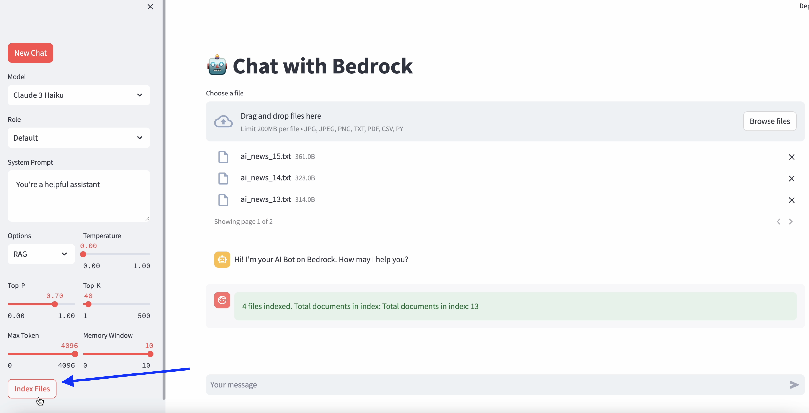
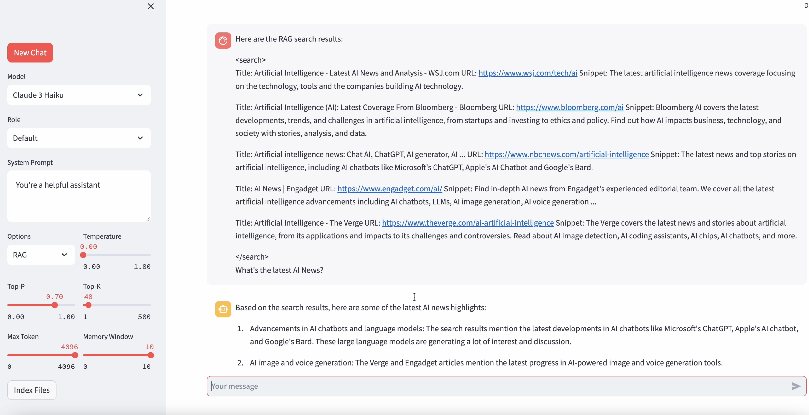

# Bedrock ChatBot with LangChain and Streamlit (New Converse API) 💬 
A simple and clear example for implement a chatbot with Bedrock + LangChain + Streamlit. Know-how and build whatever you want. Just install and run the code~ 🚀
```
pip install -r requirements.txt
streamlit run bedrock/bedrock_chatbot.py
```

Demo:


> Note: if you're going to use web search function, add your SERPAPI key and AWS region to bedrock/.env file~

> Tips: you could modify retry mode in AWS profile config for model access in case rate limit
> ```
> [default]
> max_attempts = 10
> retry_mode = adaptive

# Updates
## Enhanced RAG (Retrieval-Augmented Generation) Feature

We have significantly enhanced the RAG feature in our AI model. Now, it allows users to upload their own documents and index them either locally or on a server. 

The uploaded documents are indexed and stored persistently on the chosen location. This means that the indexed documents can be reused anytime without needing to be re-uploaded or re-indexed. 

Moreover, you can continually add more documents to the existing index, making the system increasingly robust and knowledgeable over time. 

To use the enhanced RAG feature, select 'RAG' from the 'Options' dropdown in the chatbot interface, and follow the prompts to upload and index your documents.






## Indexing Documents and Using RAG Feature

To use the RAG (Retrieval-Augmented Generation) feature, you need to index your documents using the `bedrock_indexer.py` script. This script creates a FAISS index from the documents in a directory.

Here's how to use it:

1. Add your documents to the "documents" directory. These can be text files or other types of documents that you want the RAG model to use for information retrieval.
2. Run the `bedrock_indexer.py` script:

```bash
python bedrock_indexer.py
```
